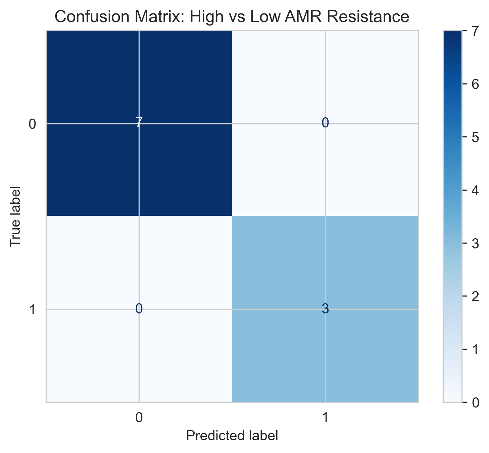
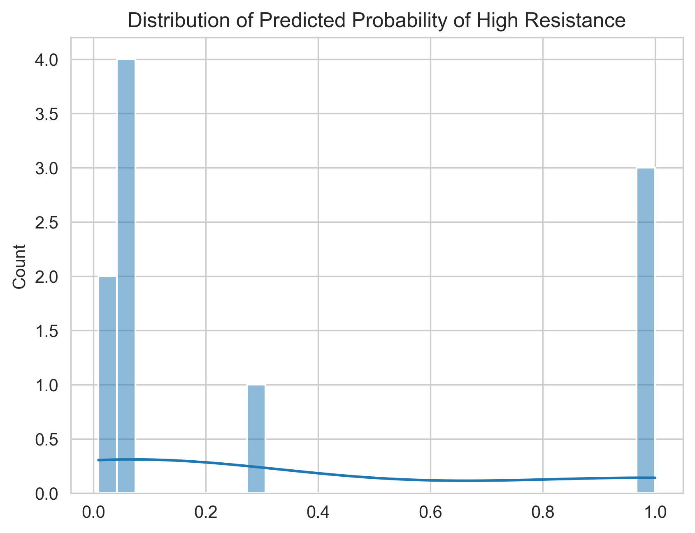
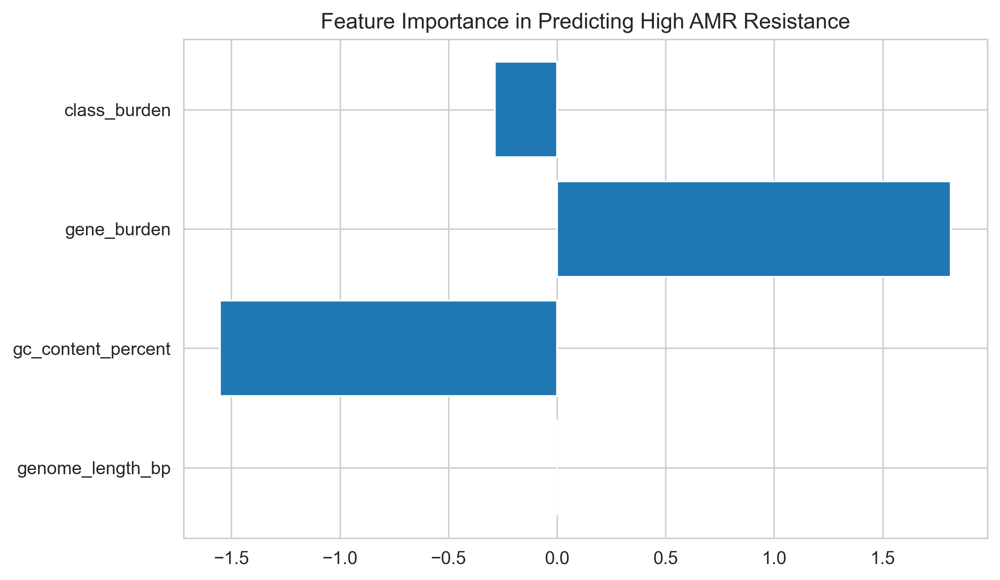

# 🧬 Antimicrobial Resistance Prediction using Machine Learning

## 📌 Overview
This project explores antimicrobial resistance (AMR) through a machine learning lens, leveraging genomic and biological features to predict resistance patterns in bacterial isolates. The aim is not only prediction, but also interpretability—identifying which biological factors contribute most significantly to resistance outcomes.

This project demonstrates an end-to-end machine learning workflow, from data preprocessing and feature engineering to model evaluation and interpretation.

---

## 🎯 Objective
To develop an interpretable machine learning pipeline that:

- Predicts antimicrobial resistance using structured genomic features  
- Identifies key biological drivers influencing resistance  
- Evaluates model performance using classification metrics  
- Balances predictive accuracy with interpretability for healthcare relevance  

---

## 📊 Dataset
The dataset contains structured genomic and resistance-related attributes used to classify bacterial isolates.

Key components include:
- Genomic feature descriptors (gene-level and structural indicators)  
- Resistance classification labels (binary or multi-class depending on formulation)  
- Engineered biological features derived from domain-informed transformations  

---

## ⚙️ Methodology

### 1. Data Preprocessing
- Handling missing values and data inconsistencies  
- Encoding categorical variables where necessary  
- Preparing structured input features for modeling  

### 2. Feature Engineering
- Construction of biologically meaningful features (e.g., gene burden, resistance diversity)  
- Selection of relevant predictors based on domain relevance and variability  
- Normalization/standardization of numerical features  

### 3. Exploratory Data Analysis
- Distribution analysis of resistance classes  
- Correlation analysis between genomic features and resistance outcomes  
- Identification of key patterns and feature relationships  

### 4. Machine Learning Models
- Logistic Regression (interpretable baseline model)  
- Random Forest Classifier (non-linear model for comparison)  

### 5. Model Evaluation
- Accuracy Score  
- Confusion Matrix  
- ROC-AUC Curve (for probabilistic evaluation)  
- Feature importance analysis for interpretability  

---

## 📈 Key Results

- Genomic structure alone is insufficient; engineered features significantly improve predictive performance  
- Gene-level features show stronger predictive power than broad genomic summaries  
- Logistic Regression provides interpretability, while ensemble models improve accuracy  
- Results highlight the importance of feature engineering in biomedical ML applications  

---

## 📊 Visualizations

### Confusion Matrix

### Distribution of Predicted Probability of High Resistance

### Feature Importance

---

## 🧠 Key Learnings

- Importance of feature engineering in high-dimensional biological datasets  
- Trade-off between interpretability and model performance in healthcare ML  
- Value of structured preprocessing in improving model reliability  
- Practical application of classification models in biomedical contexts  

---

## 🛠️ Tools & Technologies
- Python  
- Pandas  
- NumPy  
- Scikit-learn  
- Matplotlib  
- Seaborn  

---

## 🚀 Future Work
- Integration of deeper genomic datasets and richer biological annotations  
- Exploration of advanced models (XGBoost, Neural Networks)  
- Application of explainability techniques (SHAP, LIME)  
- Extension to multi-class or multi-label resistance prediction tasks  

---

## 📌 Note
This project is part of a broader portfolio exploring the application of data science and machine learning in healthcare systems, with a focus on interpretability and real-world impact.
